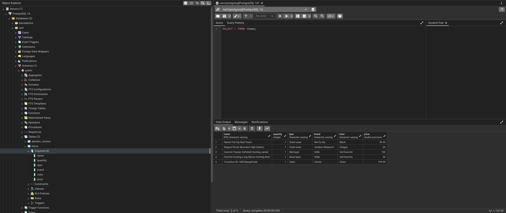
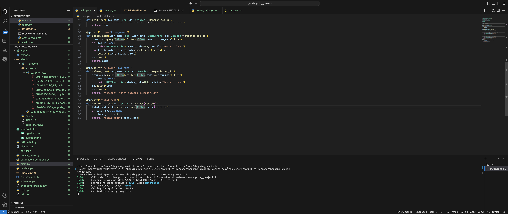

## Shopping Cart Project: This is a basic python application using alembic and fast API. It takes a cart of items I plan to purchase in json format and migrates it to a pgAdmin4 using Postgres; It also includes basic CRUD operations as well as a function to add up the total cost of everything in the cart. It does not currently have a frontend. Below are the steps needed to run it.

## 1: Set up virtual environment.
## 2: Install requirements file.
## 3: Run 'alembic upgrade head'. This will migrate the json data to PgAdmin through Postgres. Be sure that you have selected the correct server.
## 4: In PgAdmin, open the query tool and run 'SELECT * FROM items;'. The output terminal should show your table with all the items from the shopping cart json file, as seen below:
##  
## 5: Back in your ide terminal, run 'uvicorn main:app --reload'. This will start the server for fastAPI.
## 
## 6: Hold command and click on this html link in the terminal 'http://127.0.0.1:8000'
## 7: This will show a blank webpage because this application doesn't have a frontend currently and have a 404 error. 
## 8: Go to the search bar of your browser and replace everything to the right of your port with /docs and search. Your url should look something like this: 'http://127.0.0.1:8000/docs'. 
## 
## 9: Here in Swagger, you can add to, delete from, update, and view the cart as well as add the total cost of all the items in your cart. Simply click 'try it out' and enter the desired data in the corresponding field.
